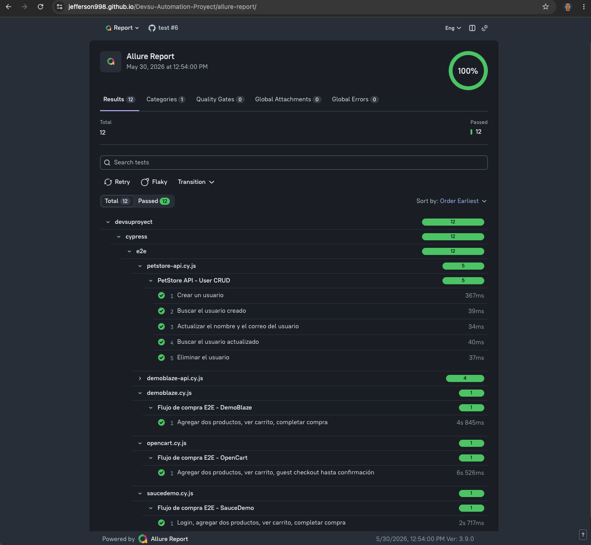
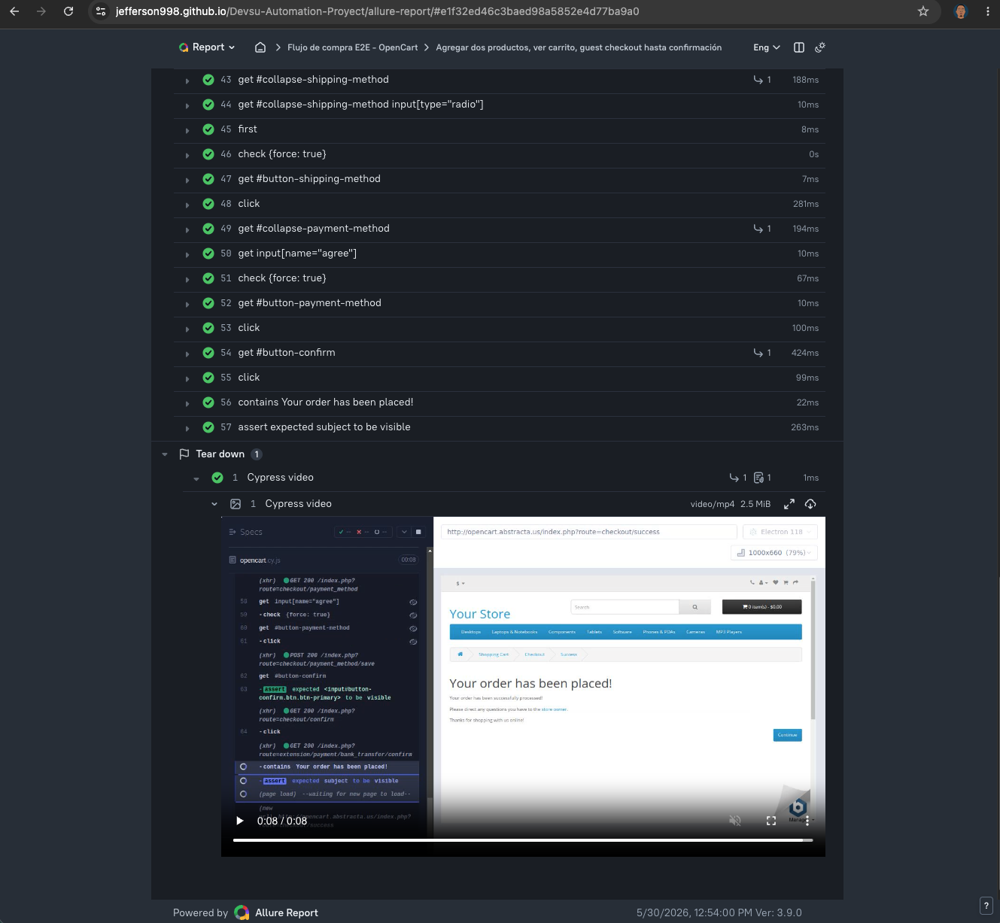
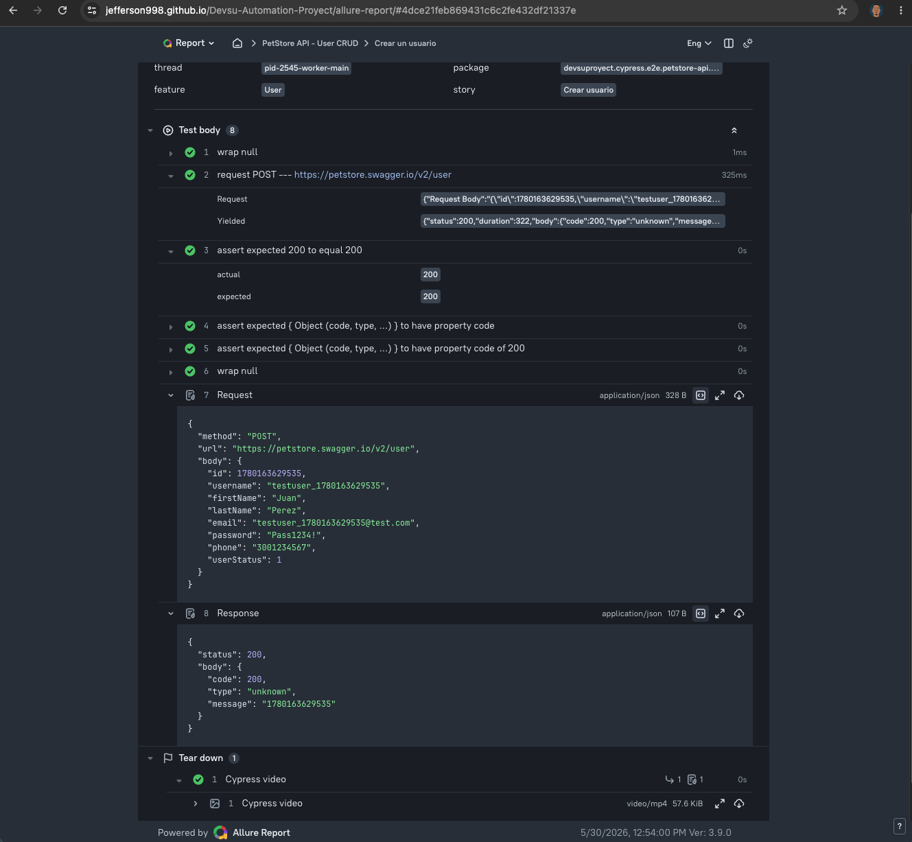
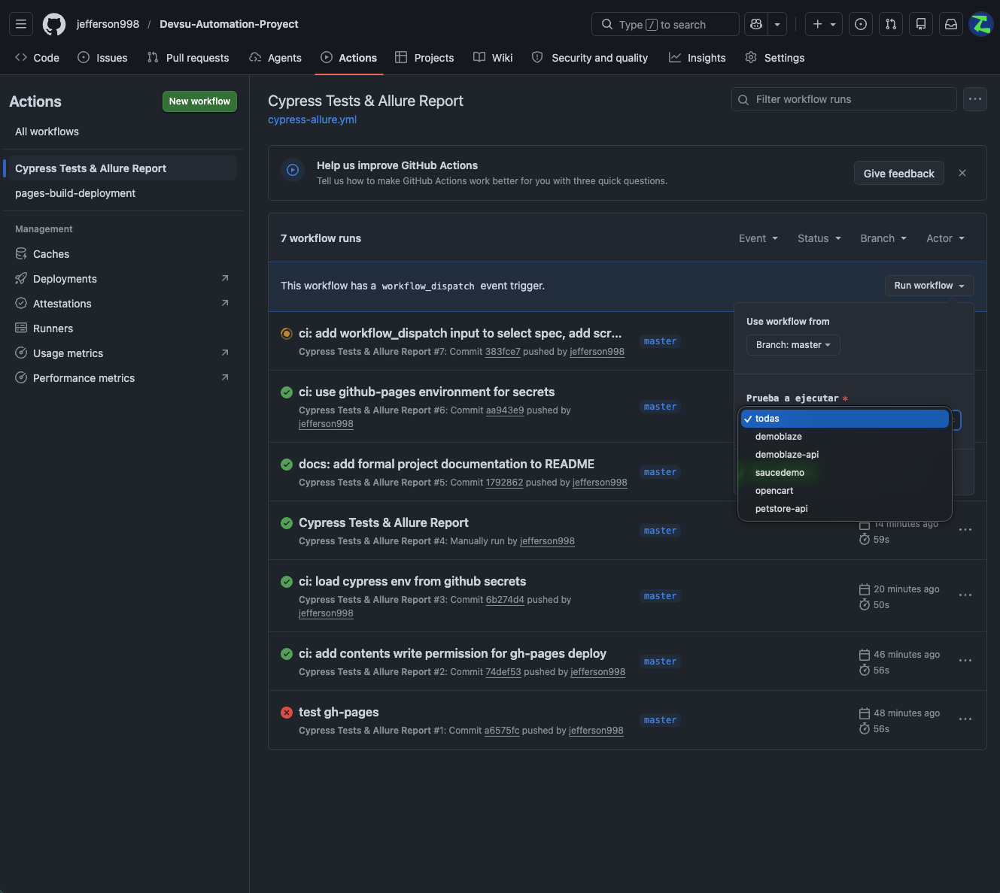

# Proyecto de Automatización de Pruebas

Este proyecto contiene pruebas automatizadas de tipo **End-to-End (E2E)** y de **API REST**, desarrolladas con **Cypress 13** e integradas con **Allure Report v3** para la generación de reportes. El pipeline de integración continua está configurado en **GitHub Actions** y publica el reporte automáticamente en **GitHub Pages**.

### 📊 Reporte publicado

El reporte de resultados más reciente está disponible en:

**[https://jefferson998.github.io/Automation-Proyect/allure-report/](https://jefferson998.github.io/Automation-Proyect/allure-report/)**

---

## Capturas del reporte

### Dashboard general — 12/12 pruebas aprobadas (100%)



### Detalle de prueba E2E — Pasos y video adjunto



### Detalle de prueba API — Request y Response adjuntos



---

## Tabla de contenido

- [Requisitos previos](#requisitos-previos)
- [Instalación](#instalación)
- [Configuración de variables de entorno](#configuración-de-variables-de-entorno)
- [Ejecución de pruebas](#ejecución-de-pruebas)
- [Generación del reporte Allure](#generación-del-reporte-allure)
- [Integración continua](#integración-continua)
- [Estructura del proyecto](#estructura-del-proyecto)

---

## Requisitos previos

Antes de ejecutar el proyecto, asegúrese de tener instalado lo siguiente:

| Herramienta | Versión mínima recomendada |
|---|---|
| Node.js | 18 o superior |
| npm | 9 o superior |
| Git | cualquier versión reciente |

---

## Instalación

1. Clone el repositorio en su equipo:

```bash
git clone https://github.com/jefferson998/Automation-Proyect.git
cd Automation-Proyect
```

2. Instale las dependencias del proyecto:

```bash
npm install
```

---

## Configuración de variables de entorno

El proyecto utiliza un archivo `cypress.env.json` para gestionar las variables de entorno (URLs, credenciales y datos de prueba). Este archivo **no se incluye en el repositorio** por razones de seguridad.

### Creación del archivo

Ejecute el siguiente comando en la raíz del proyecto para crear el archivo con todas las variables necesarias:

```bash
cat <<EOF > cypress.env.json
{
  "DEMOBLAZE_URL": "https://www.demoblaze.com",
  "DEMOBLAZE_API_URL": "https://api.demoblaze.com",
  "DEMOBLAZE_EXISTING_USER": "admin",
  "DEMOBLAZE_PASSWORD": "Test1234!",
  "SAUCEDEMO_URL": "https://www.saucedemo.com",
  "SAUCEDEMO_USER": "standard_user",
  "SAUCEDEMO_PASSWORD": "secret_sauce",
  "OPENCART_URL": "http://opencart.abstracta.us",
  "PETSTORE_API_URL": "https://petstore.swagger.io/v2",
  "CHECKOUT_FIRST_NAME": "Usuario",
  "CHECKOUT_LAST_NAME": "Prueba",
  "CHECKOUT_EMAIL": "testuser@mailnull.com",
  "CHECKOUT_PHONE": "3001234567",
  "CHECKOUT_ADDRESS": "Calle 123",
  "CHECKOUT_CITY": "Bogota",
  "CHECKOUT_POSTCODE": "110111",
  "CHECKOUT_COUNTRY": "Colombia",
  "CHECKOUT_ZONE": "Bogota D.C.",
  "CHECKOUT_CARD": "4111111111111111",
  "CHECKOUT_CARD_MONTH": "12",
  "CHECKOUT_CARD_YEAR": "2028"
}
EOF
```

> **Nota:** El archivo `cypress.env.json` está incluido en `.gitignore` y nunca debe subirse al repositorio.

---

## Ejecución de pruebas

### Ejecutar todas las pruebas

```bash
npx cypress run
```

### Ejecutar una prueba específica

```bash
# Pruebas E2E - DemoBlaze
npx cypress run --spec "cypress/e2e/demoblaze.cy.js"

# Pruebas E2E - SauceDemo
npx cypress run --spec "cypress/e2e/saucedemo.cy.js"

# Pruebas E2E - OpenCart
npx cypress run --spec "cypress/e2e/opencart.cy.js"

# Pruebas de API - DemoBlaze (Signup & Login)
npx cypress run --spec "cypress/e2e/demoblaze-api.cy.js"

# Pruebas de API - PetStore (CRUD de usuario)
npx cypress run --spec "cypress/e2e/petstore-api.cy.js"
```

### Abrir la interfaz interactiva de Cypress

```bash
npx cypress open
```

---

## Generación del reporte Allure

Los resultados de las pruebas se guardan automáticamente en la carpeta `allure-results/` al ejecutar Cypress.

### Generar el reporte

```bash
npm run allure:generate
```

### Abrir el reporte en el navegador

```bash
npm run allure:open
```

### Generar y servir en un solo comando

```bash
npm run allure:serve
```

---

## Integración continua

El proyecto incluye un workflow de **GitHub Actions** que se ejecuta automáticamente en cada `push` o `pull request` hacia las ramas `main` o `master`. El pipeline realiza los siguientes pasos:

1. Descarga el código fuente del repositorio.
2. Instala las dependencias del proyecto.
3. Construye el archivo `cypress.env.json` a partir de los **secrets** configurados en GitHub.
4. Ejecuta todas las pruebas Cypress.
5. Sube los videos de ejecución como artefacto descargable.
6. Genera el reporte Allure.
7. Publica el reporte en **GitHub Pages** (rama `gh-pages`).

### Ejecución manual por funcionalidad

El workflow puede ejecutarse manualmente desde GitHub Actions seleccionando la prueba deseada en el campo **"Prueba a ejecutar"**. Esto permite correr una suite específica sin necesidad de hacer un push al repositorio.

**Ruta:** Actions → Cypress Tests & Allure Report → Run workflow



## Estructura del proyecto

```
├── .github/
│   └── workflows/
│       └── cypress-allure.yml      # Pipeline de GitHub Actions
├── cypress/
│   ├── e2e/
│   │   ├── demoblaze.cy.js         # Pruebas E2E - DemoBlaze
│   │   ├── demoblaze-api.cy.js     # Pruebas de API - DemoBlaze
│   │   ├── saucedemo.cy.js         # Pruebas E2E - SauceDemo
│   │   ├── opencart.cy.js          # Pruebas E2E - OpenCart
│   │   └── petstore-api.cy.js      # Pruebas de API - PetStore
│   └── support/
│       ├── commands.js             # Comandos personalizados de Cypress
│       └── e2e.js                  # Configuración del soporte global
├── cypress.config.js               # Configuración principal de Cypress
├── cypress.env.json                # Variables de entorno (no incluido en el repo)
├── package.json                    # Dependencias y scripts del proyecto
└── README.md                       # Este archivo
```
